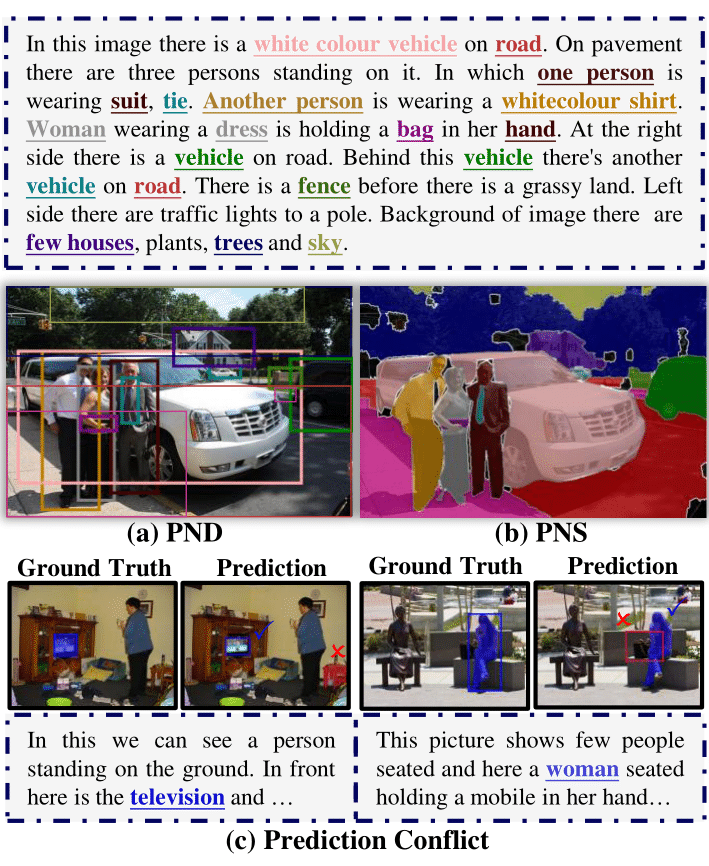

# NICE: Improving Panoptic Narrative Detection and Segmentation with Cascading Collaborative Learning
The offical implementation of "NICE: Improving Panoptic Narrative Detection and Segmentation with Cascading Collaborative Learning".
## What is NICE?
NICE is a multi-task collaborative cascaded framework for Panoptic Narrative Segmentation and Panoptic Narrative Detection (Visual Grounding). It introduces a novel insight that is "mask first and box next".
<div align=center></div>

## Instruction
### Environments
You need the Pytorch >= 1.7.1, and follow the command that:
```
conda create -n nice python=3.7.15
conda activate nice
conda install pytorch==1.7.1 torchvision==0.8.2 torchaudio==0.7.2 cudatoolkit=11.0 -c pytorch
pip install -r requirements.txt
```
After that, please follow the [instruction of detectron2](https://github.com/facebookresearch/detectron2/blob/main/INSTALL.md) to install detectron2 for the enviroment with:
```
python -m pip install -e detectron2
```
### Dataset
1. Download the 2017 MSCOCO Dataset from its [official webpage](https://cocodataset.org/#download). You will need the train and validation splits' images and panoptic segmentations annotations.
2. Download the Panoptic Narrative Grounding Benchmark from the PNG's [project webpage](https://bcv-uniandes.github.io/panoptic-narrative-grounding/#downloads). Organize the files as follows:
```
NICE
|_ panoptic_narrative_grounding
   |_ images
   |  |_ train2017
   |  |_ val2017
   |_ annotations
   |  |_ png_coco_train2017.json
   |  |_ png_coco_val2017.json
   |  |_ panoptic_segmentation
   |  |  |_ train2017
   |  |  |_ val2017
   |  |_ panoptic_train2017.json
   |  |_ panoptic_val2017.json
|_ data
```
3. Pre-process the Panoptic narrative Grounding Ground-Truth Annotation for the dataloader using [utils/pre_process.py](utils/pre_process.py).
4. At the end of this step you should have two new files in your annotations folder.
```
panoptic_narrative_grounding
|_ annotations
   |_ png_coco_train2017.json
   |_ png_coco_val2017.json
   |_ png_coco_train2017_dataloader.json
   |_ png_coco_val2017_dataloader.json
   |_ panoptic_segmentation
   |  |_ train2017
   |  |_ val2017
   |_ panoptic_train2017.json
   |_ panoptic_val2017.json
```

### Pretrained Bert Model and PFPN
The pre-trained checkpoint can be downloaded from [here](https://drive.google.com/drive/folders/1xrJmbBJ35M4O1SNyzb9ZTsvlYrwmkAph?usp=drive_link), and the folder should be like:
```
pretrained_models
|_fpn
|  |_model_final_cafdb1.pkl
|_bert
|  |_bert-base-uncased
|  |  |_pytorch_model.bin
|  |  |_bert_config.json
|  |_bert-base-uncased.txt
```

### Train and Inference
Modify the routes in [train_net.sh](train_net.sh) according to your local paths. If you want to only test the pretrained model, add `--ckpt_path ${PRETRAINED_MODEL_PATH}` and `--test_only`.

### Customized
You can try to only train the PND task (visual grounding) with ignore the output of masks. We provide the Flickr30K Entries to test the PND task only. You can check the [train_net_flickr.py](train_net_flickr.py) and replace it on the [main.py](main.py) to adapt the PND task. 
For dataset, you can download the Flickr30K annotations from [here](https://drive.google.com/file/d/19qJ8b5sxijKmtN0XG9leWbt2sPkIVqlc/view) and the image from the [offical](http://hockenmaier.cs.illinois.edu/DenotationGraph/).
## Acknowledge
Some of the codes are built upon [K-Net](https://github.com/ZwwWayne/K-Net) and [PNG](https://github.com/BCV-Uniandes/PNG). Thanks them for their great works!
